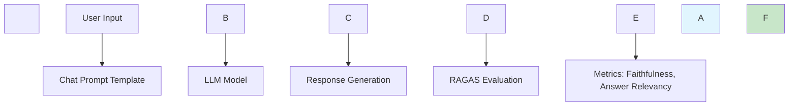
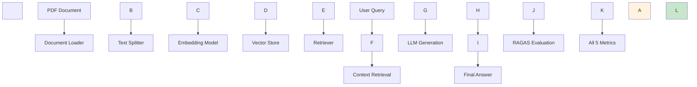
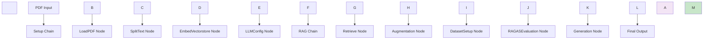
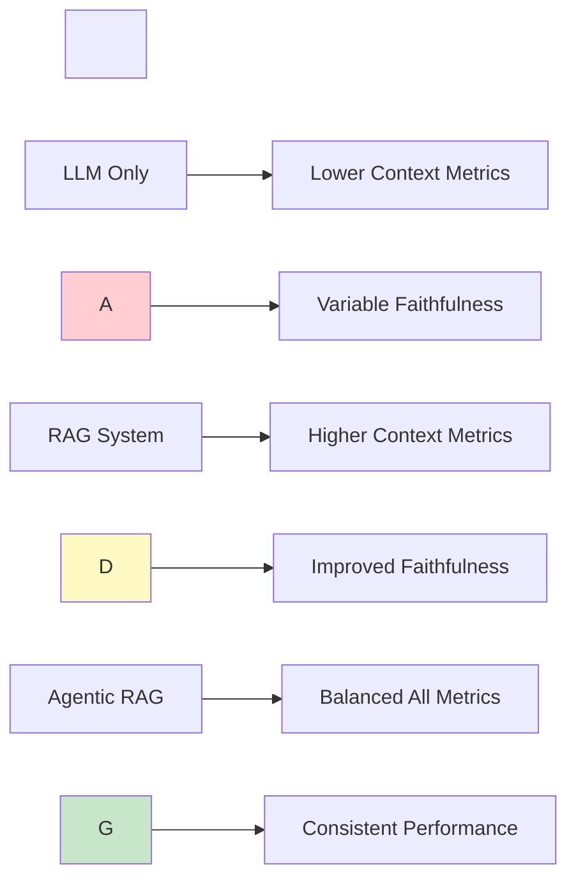

\# RAGAS Evaluation Framework: Comprehensive Analysis of LLM, RAG, and Agentic RAG Pipelines


\## 🎯 Overview


This repository contains three distinct implementations for evaluating AI systems using the RAGAS (Retrieval-Augmented Generation Assessment) framework. Each implementation targets different architectural patterns:


1\. \*\*LLM Pipeline\*\*: Direct language model evaluation

2\. \*\*RAG Pipeline\*\*: Retrieval-Augmented Generation system evaluation

3\. \*\*Agentic RAG Pipeline\*\*: Multi-agent RAG system with LangGraph workflow


\## 📊 RAGAS Metrics Explained


RAGAS provides a comprehensive set of evaluation metrics including Context Precision, Context Recall, Faithfulness, Answer Relevancy, and Factual Correctness. These metrics enable thorough analysis of AI system performance across different dimensions.


\### Core Metrics


\#### 1. \*\*Faithfulness\*\* 📋

Faithfulness is a ratio of the number of statements present in the answer which can be inferred from the context and the total number of statements present in the answer.


\*\*Formula\*\*: `Faithfulness = (Number of Faithful Statements) / (Total Number of Statements)`


\*\*Range\*\*: 0.0 - 1.0 (Higher is better)


\#### 2. \*\*Answer Relevancy\*\* 🎯

Answer Relevance measures whether the generated text effectively answers the query to fulfill the user's intent.


\*\*Calculation\*\*: Uses cosine similarity between question and generated answer embeddings.


\*\*Range\*\*: 0.0 - 1.0 (Higher is better)


\#### 3. \*\*Context Precision\*\* 🔍

Context precision measures how well the app retrieves data from the vector store.


\*\*Formula\*\*: `Context Precision = (Relevant Retrieved Contexts) / (Total Retrieved Contexts)`


\*\*Range\*\*: 0.0 - 1.0 (Higher is better)


\#### 4. \*\*Context Recall\*\* 📚

Context recall quantifies how well the system retrieves comprehensive information.


\*\*Formula\*\*: `Context Recall = (Retrieved Relevant Contexts) / (Total Relevant Contexts in Dataset)`


\*\*Range\*\*: 0.0 - 1.0 (Higher is better)


\#### 5. \*\*Factual Correctness\*\* ✅

Measures the factual accuracy of generated responses against ground truth.


\*\*Range\*\*: 0.0 - 1.0 (Higher is better)


\## 🏗️ Architecture Comparison


\### 1. LLM Pipeline Architecture





\*\*Key Features\*\*:

\- Direct LLM interaction without retrieval

\- Focuses on generation quality metrics

\- Minimal context dependency

\- Evaluates: Faithfulness, Answer Relevancy


\### 2. RAG Pipeline Architecture





\*\*Key Features\*\*:

\- Complete RAG pipeline with PDF processing

\- Advanced retrieval with reranking

\- Comprehensive evaluation across all metrics

\- Uses HuggingFace embeddings and FAISS vector store


\### 3. Agentic RAG Pipeline Architecture





\*\*Key Features\*\*:

\- Multi-agent workflow using LangGraph

\- Modular node-based architecture

\- Built-in evaluation pipeline

\- Memory management with checkpointing


\## 📈 Performance Analysis


\### Metric Interpretation Guide


| Metric | Excellent | Good | Needs Improvement |

|--------|-----------|------|-------------------|

| \*\*Faithfulness\*\* | > 0.8 | 0.6 - 0.8 | < 0.6 |

| \*\*Answer Relevancy\*\* | > 0.8 | 0.6 - 0.8 | < 0.6 |

| \*\*Context Precision\*\* | > 0.8 | 0.6 - 0.8 | < 0.6 |

| \*\*Context Recall\*\* | > 0.7 | 0.5 - 0.7 | < 0.5 |

| \*\*Factual Correctness\*\* | > 0.8 | 0.6 - 0.8 | < 0.6 |


\### Expected Performance Patterns





\## 🔧 Implementation Details


\### Configuration Parameters


\#### RAG Pipeline Configuration

```python

class RAGConfig:

&nbsp;   CHUNK\_SIZE = 500

&nbsp;   CHUNK\_OVERLAP = 50

&nbsp;   EMBEDDING\_MODEL = "sentence-transformers/all-MiniLM-L6-v2"

&nbsp;   LLM\_MODEL = "gpt-4"

&nbsp;   RETRIEVER\_K = 15

&nbsp;   RETRIEVER\_FETCH\_K = 30

&nbsp;   TOP\_K\_AFTER\_RERANK = 3

```


\#### Agentic RAG Configuration

```python

\# LangGraph State Management

class SetupChainState(TypedDict):

&nbsp;   pdf\_path: str

&nbsp;   documents: list

&nbsp;   vectorstore: object

&nbsp;   retriever: object

&nbsp;   llm: object

```


\### Advanced Features


\#### 1. \*\*Reranking in RAG Pipeline\*\*

\- Uses CrossEncoder for improved relevance

\- Implements MMR (Maximal Marginal Relevance) retrieval

\- Custom retriever with configurable parameters


\#### 2. \*\*LangGraph Workflow in Agentic RAG\*\*

\- State-based execution flow

\- Checkpointing for conversation continuity

\- Visual workflow representation


\## 🚀 Getting Started


\### Prerequisites

```bash

pip install langchain sentence-transformers faiss-cpu pypdf openai 

pip install langchain-community langchain-openai ragas datasets 

pip install pandas numpy langchain-huggingface langgraph

```


\### Running the Evaluations


1\. \*\*LLM Pipeline\*\*:

&nbsp;  ```python

&nbsp;  python llm\_evaluation.py

&nbsp;  ```


2\. \*\*RAG Pipeline\*\*:

&nbsp;  ```python

&nbsp;  python rag\_evaluation.py

&nbsp;  ```


3\. \*\*Agentic RAG Pipeline\*\*:

&nbsp;  ```python

&nbsp;  python agentic\_rag\_evaluation.py

&nbsp;  ```


\### Environment Setup

```bash

export OPENAI\_API\_KEY="your-openai-key"

export GROQ\_API\_KEY="your-groq-key"  # For LLM pipeline

```


\## 📊 Evaluation Results Format


\### Output Structure

```json

{

&nbsp; "timestamp": "2024-XX-XX XX:XX:XX",

&nbsp; "configuration": {

&nbsp;   "chunk\_size": 500,

&nbsp;   "embedding\_model": "sentence-transformers/all-MiniLM-L6-v2",

&nbsp;   "llm\_model": "gpt-4",

&nbsp;   "retriever\_k": 15

&nbsp; },

&nbsp; "evaluation\_metrics": {

&nbsp;   "faithfulness": 0.85,

&nbsp;   "answer\_relevancy": 0.78,

&nbsp;   "context\_precision": 0.82,

&nbsp;   "context\_recall": 0.76,

&nbsp;   "factual\_correctness": 0.79

&nbsp; }

}

```


\## 🎯 Key Insights


\### When to Use Each Pipeline


1\. \*\*LLM Pipeline\*\*: 

&nbsp;  - Simple question-answering tasks

&nbsp;  - When external knowledge is not required

&nbsp;  - Rapid prototyping and testing


2\. \*\*RAG Pipeline\*\*: 

&nbsp;  - Document-based question answering

&nbsp;  - When accuracy and source attribution are critical

&nbsp;  - Production RAG systems


3\. \*\*Agentic RAG Pipeline\*\*: 

&nbsp;  - Complex multi-step reasoning

&nbsp;  - When workflow transparency is needed

&nbsp;  - Research and development environments


\### Performance Optimization Tips


1\. \*\*Improve Faithfulness\*\*: 

&nbsp;  - Use more specific prompts

&nbsp;  - Implement better context filtering

&nbsp;  - Reduce hallucination through fine-tuning


2\. \*\*Enhance Answer Relevancy\*\*: 

&nbsp;  - Optimize embedding models

&nbsp;  - Improve query understanding

&nbsp;  - Use query expansion techniques


3\. \*\*Boost Context Metrics\*\*: 

&nbsp;  - Tune retrieval parameters

&nbsp;  - Implement hybrid search

&nbsp;  - Use reranking models


\## 🔍 Troubleshooting


\### Common Issues


1\. \*\*Low Faithfulness Scores\*\*:

&nbsp;  - Check if LLM is hallucinating

&nbsp;  - Verify context quality

&nbsp;  - Adjust temperature settings


2\. \*\*Poor Context Retrieval\*\*:

&nbsp;  - Tune chunk size and overlap

&nbsp;  - Experiment with different embedding models

&nbsp;  - Implement query preprocessing


3\. \*\*Memory Issues\*\*:

&nbsp;  - Reduce batch sizes

&nbsp;  - Use streaming for large documents

&nbsp;  - Implement checkpointing


\## 📚 References


\- RAGAS Documentation: Comprehensive evaluation metrics for RAG systems

\- RAGAs Framework: Reference-free evaluation methodology

\- LangChain Documentation: Building AI applications

\- LangGraph Documentation: Multi-agent workflows


\## 🤝 Contributing


1\. Fork the repository

2\. Create a feature branch

3\. Add your evaluation implementation

4\. Submit a pull request with detailed metrics analysis


\## 📄 License


This project is licensed under the MIT License - see the LICENSE file for details.


---


\*\*Note\*\*: The RAGAS score is the mean of Faithfulness, Answer relevancy, Context recall, and Context precision - a single measure evaluating the most critical aspects of retrieval and generation in a RAG system.

