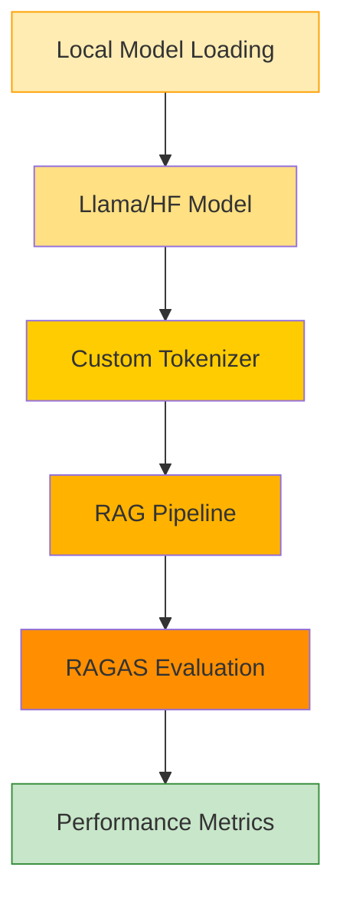
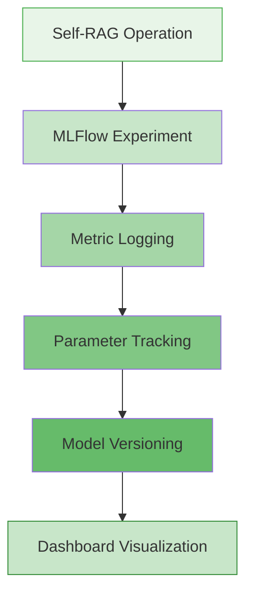
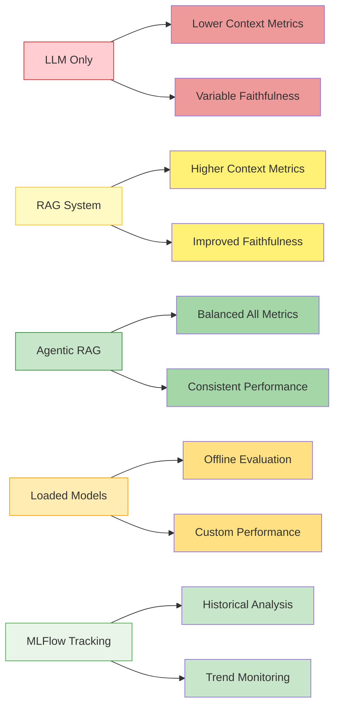

# RAGAS Evaluation Framework: Comprehensive Analysis of LLM, RAG, and Agentic RAG Pipelines

## 🎯 Overview of the Repository

This repository contains five distinct implementations for evaluating AI systems using the **RAGAS** (Retrieval-Augmented Generation Assessment) framework. Each implementation targets different architectural patterns and use cases:

1. **LLM Pipeline**: Direct language model evaluation
2. **RAG Pipeline**: Retrieval-Augmented Generation system evaluation
3. **Agentic RAG Pipeline**: Multi-agent RAG system with LangGraph workflow
4. **RAGAS with Loaded HuggingFace Models**: Evaluation using locally loaded models like Llama
5. **RAGAS with MLFlow Tracking**: Self-RAG operations with comprehensive experiment tracking

## 📊 RAGAS Metrics Explained

RAGAS provides a comprehensive set of evaluation metrics to analyze AI system performance across multiple dimensions: **Context Precision**, **Context Recall**, **Faithfulness**, **Answer Relevancy**, and **Factual Correctness**.

### Core Metrics

#### 1. **Faithfulness** 📋
Measures how well the generated answer aligns with the provided context.

**Formula**: `Faithfulness = (Number of Faithful Statements) / (Total Number of Statements)`

**Range**: 0.0 - 1.0 (Higher is better)

#### 2. **Answer Relevancy** 🎯
Evaluates whether the generated response effectively addresses the user's query.

**Calculation**: Cosine similarity between question and answer embeddings.

**Range**: 0.0 - 1.0 (Higher is better)

#### 3. **Context Precision** 🔍
Assesses the relevance of retrieved contexts.

**Formula**: `Context Precision = (Relevant Retrieved Contexts) / (Total Retrieved Contexts)`

**Range**: 0.0 - 1.0 (Higher is better)

#### 4. **Context Recall** 📚
Quantifies the completeness of retrieved information.

**Formula**: `Context Recall = (Retrieved Relevant Contexts) / (Total Relevant Contexts in Dataset)`

**Range**: 0.0 - 1.0 (Higher is better)

#### 5. **Factual Correctness** ✅
Evaluates the factual accuracy of responses against ground truth.

**Range**: 0.0 - 1.0 (Higher is better)

## 🏗️ Architecture Comparison

### 1. LLM Pipeline Architecture


**Key Features**:
- Direct interaction with the LLM
- Focuses on generation quality
- Minimal context dependency
- Evaluates: Faithfulness, Answer Relevancy

### 2. RAG Pipeline Architecture


**Key Features**:
- Full RAG pipeline with document processing
- Advanced retrieval with reranking
- Comprehensive evaluation across all metrics
- Utilizes HuggingFace embeddings and FAISS vector store

### 3. Agentic RAG Pipeline Architecture


**Key Features**:
- Multi-agent workflow using LangGraph
- Modular, node-based architecture
- Built-in evaluation pipeline
- Memory management with checkpointing

### 4. RAGAS with Loaded HuggingFace Models



**Key Features**:
- Offline model evaluation
- Custom HuggingFace model integration
- Resource-efficient local processing
- Supports various open-source models

### 5. RAGAS with MLFlow Tracking



**Key Features**:
- Comprehensive experiment tracking
- Real-time metrics monitoring
- Model performance comparison
- Automated logging and visualization

## 📈 Performance Analysis

### Metric Interpretation Guide

| Metric | Excellent | Good | Needs Improvement |
|--------|-----------|------|-------------------|
| **Faithfulness** | > 0.8 | 0.6 - 0.8 | < 0.6 |
| **Answer Relevancy** | > 0.8 | 0.6 - 0.8 | < 0.6 |
| **Context Precision** | > 0.8 | 0.6 - 0.8 | < 0.6 |
| **Context Recall** | > 0.7 | 0.5 - 0.7 | < 0.5 |
| **Factual Correctness** | > 0.8 | 0.6 - 0.8 | < 0.6 |

### Expected Performance Patterns



## 🔧 Implementation Details

### Configuration Parameters

#### RAG Pipeline Configuration
```python
class RAGConfig:
    CHUNK_SIZE = 500
    CHUNK_OVERLAP = 50
    EMBEDDING_MODEL = "sentence-transformers/all-MiniLM-L6-v2"
    LLM_MODEL = "gpt-4"
    RETRIEVER_K = 15
    RETRIEVER_FETCH_K = 30
    TOP_K_AFTER_RERANK = 3
```

#### Agentic RAG Configuration
```python
# LangGraph State Management
class SetupChainState(TypedDict):
    pdf_path: str
    documents: list
    vectorstore: object
    retriever: object
    llm: object
```

#### Loaded Models Configuration
```python
class LoadedModelConfig:
    MODEL_NAME = "meta-llama/Llama-2-7b-chat-hf"
    DEVICE = "cuda" if torch.cuda.is_available() else "cpu"
    MAX_LENGTH = 2048
    TEMPERATURE = 0.7
```

#### MLFlow Configuration
```python
class MLFlowConfig:
    EXPERIMENT_NAME = "RAGAS_Self_RAG_Evaluation"
    TRACKING_URI = "http://localhost:5000"
    ARTIFACT_PATH = "ragas_models"
    REGISTERED_MODEL_NAME = "SelfRAG_Model"
```

### Advanced Features

#### 1. **Reranking in RAG Pipeline**
- Employs CrossEncoder for enhanced relevance
- Implements MMR (Maximal Marginal Relevance) retrieval
- Configurable retriever parameters

#### 2. **LangGraph Workflow in Agentic RAG**
- State-based execution flow
- Checkpointing for conversation continuity
- Visual workflow representation

#### 3. **Local Model Integration**
- HuggingFace Transformers integration
- Custom tokenization handling
- Memory-efficient model loading

#### 4. **MLFlow Experiment Tracking**
- Automated metrics logging
- Parameter and hyperparameter tracking
- Model artifact management
- Performance comparison dashboards

## 🚀 Getting Started

### Prerequisites
```bash
pip install langchain sentence-transformers faiss-cpu pypdf openai
pip install langchain-community langchain-openai ragas datasets
pip install pandas numpy langchain-huggingface langgraph
pip install torch transformers accelerate  # For loaded models
pip install mlflow  # For experiment tracking
pip install jupyter  # For running .ipynb notebooks
```

### Running the Evaluations

1. **LLM Pipeline**:
   ```bash
   jupyter notebook llm_evaluation.ipynb
   ```

2. **RAG Pipeline**:
   ```bash
   jupyter notebook rag_evaluation.ipynb
   ```

3. **Agentic RAG Pipeline**:
   ```bash
   jupyter notebook agentic_rag_evaluation.ipynb
   ```

4. **RAGAS with Loaded Models**:
   ```bash
   jupyter notebook RAGAS-LoadedMODELS_LLAMA.ipynb
   ```

5. **RAGAS with MLFlow Tracking**:
   ```bash
   # Start MLFlow server
   mlflow server --host 0.0.0.0 --port 5000
   
   # Run notebook
   jupyter notebook RAGAS-MLFLow_RAG.ipynb
   ```

### Environment Setup
```bash
export OPENAI_API_KEY="your-openai-key"
export GROQ_API_KEY="your-groq-key"  # For LLM pipeline
export HUGGINGFACE_API_TOKEN="your-hf-token"  # For loaded models
export MLFLOW_TRACKING_URI="http://localhost:5000"  # For MLFlow
```

## 📊 Evaluation Results Format

### Output Structure
```json
{
  "timestamp": "2025-XX-XX XX:XX:XX",
  "configuration": {
    "chunk_size": 500,
    "embedding_model": "sentence-transformers/all-MiniLM-L6-v2",
    "llm_model": "gpt-4",
    "retriever_k": 15
  },
  "evaluation_metrics": {
    "faithfulness": 0.85,
    "answer_relevancy": 0.78,
    "context_precision": 0.82,
    "context_recall": 0.76,
    "factual_correctness": 0.79
  },
  "mlflow_run_id": "abc123def456",  // For MLFlow tracked runs
  "model_info": {
    "model_name": "meta-llama/Llama-2-7b-chat-hf",
    "device": "cuda",
    "memory_usage": "6.2GB"
  }
}
```

## 🎯 Key Insights

### When to Use Each Pipeline

1. **LLM Pipeline**:
   - Ideal for simple question-answering tasks
   - No external knowledge required
   - Rapid prototyping and testing

2. **RAG Pipeline**:
   - Suited for document-based question answering
   - Critical for accuracy and source attribution
   - Production-grade RAG systems

3. **Agentic RAG Pipeline**:
   - Best for complex, multi-step reasoning
   - Requires workflow transparency
   - Research and development environments

4. **Loaded Models Pipeline**:
   - Offline evaluation requirements
   - Custom model fine-tuning scenarios
   - Resource-constrained environments

5. **MLFlow Tracking Pipeline**:
   - Experiment management and comparison
   - Production model monitoring
   - Team collaboration on model development

### Performance Optimization Tips

1. **Improve Faithfulness**:
   - Use specific, clear prompts
   - Enhance context filtering
   - Fine-tune to reduce hallucination

2. **Enhance Answer Relevancy**:
   - Optimize embedding models
   - Improve query understanding
   - Apply query expansion techniques

3. **Boost Context Metrics**:
   - Adjust retrieval parameters
   - Implement hybrid search
   - Utilize reranking models

4. **Optimize Loaded Models**:
   - Quantization for memory efficiency
   - Batch processing for throughput
   - Custom tokenization strategies

5. **Enhance MLFlow Tracking**:
   - Structured experiment naming
   - Comprehensive metric logging
   - Regular model comparison

## 🔍 Troubleshooting

### Common Issues

1. **Low Faithfulness Scores**:
   - Verify LLM hallucination
   - Check context quality
   - Adjust temperature settings

2. **Poor Context Retrieval**:
   - Tune chunk size and overlap
   - Experiment with embedding models
   - Preprocess queries

3. **Memory Issues**:
   - Reduce batch sizes
   - Use streaming for large documents
   - Implement checkpointing

4. **Loaded Model Issues**:
   - Check GPU memory availability
   - Verify model compatibility
   - Use appropriate quantization

5. **MLFlow Connection Issues**:
   - Ensure MLFlow server is running
   - Check tracking URI configuration
   - Verify network connectivity

## 📚 References

- [RAGAS Documentation](https://docs.ragas.io): Comprehensive evaluation metrics for RAG systems
- [RAGAS Framework](https://arxiv.org/abs/2306.10502): Reference-free evaluation methodology
- [LangChain Documentation](https://python.langchain.com/docs): Building AI applications
- [LangGraph Documentation](https://langchain-ai.github.io/langgraph): Multi-agent workflows
- [MLFlow Documentation](https://mlflow.org/docs/latest/index.html): ML experiment tracking
- [HuggingFace Transformers](https://huggingface.co/docs/transformers): Model loading and inference

## 🤝 Contributing

1. Fork the repository
2. Create a feature branch
3. Add your evaluation implementation
4. Submit a pull request with detailed metrics analysis

## 📄 License

This project is licensed under the MIT License - see the [LICENSE](LICENSE) file for details.

---

**Note**: The RAGAS score is the mean of **Faithfulness**, **Answer Relevancy**, **Context Recall**, and **Context Precision**—a single measure evaluating the most critical aspects of retrieval and generation in a RAG system.